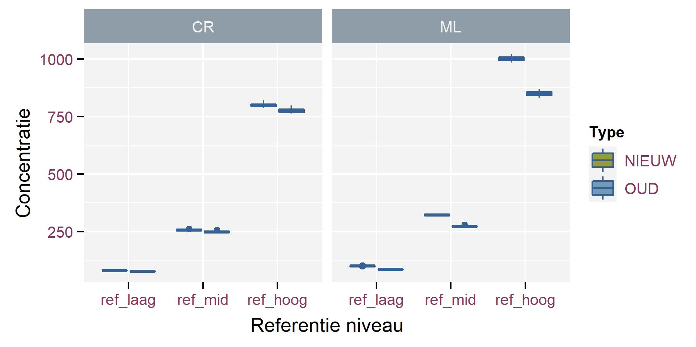
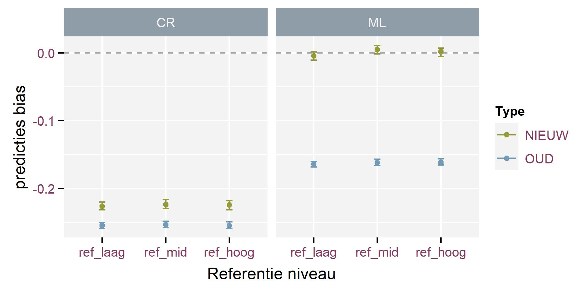

```{r setup, include=FALSE}

knitr::opts_chunk$set(
  echo = FALSE, 
  eval = TRUE,
  cache = FALSE,
  warning = FALSE,
  error = FALSE,
  message = FALSE,
  include = FALSE
  # ,
  # fig.width = 2,
  # fig.height = 1
)

library(tidyverse)
library(lme4)
library(car)
library(kableExtra)
library(INBOtheme)

```


## Context

Vraag voor analyse van experiment om na te gaan welke techniek om concentraties in bodemstalen te meten het beste is.


## Onduidelijkheden/feedback

- Verduidelijking van 'het beste'
  + grootste **precisie** in metingen? (kleinste verschillen tussen replicate metingen)
  + kleinste **afwijking** in metingen t.o.v. de 'ware' concetratie? (consequent te hoge of te lage gemeten concentraties)
- Meer achtergrond over de opzet van het experiment
- Betekenis van kolom *Staal*
  + Referentie niveau waarmee gemeten concentraties moeten vergeleken worden?
  + Betekenis van toevoegsels '_a|_b|_c'.
  + betekenis van 'staal_123'?
<!-- - Meer achtergrondinformatie over de verschillende analysetechnieken en de link met *Toestel* -->

## Aannames
- Analyse naar **afwijking** in de concentraties
- Kolom *Staal* bevat informatie over de referentie concentraties (100, 320, 1000)
- Alle rijen met hetzelfde label in kolom *Staal* zijn substalen uit hetzelfde staal
- Rijen met 'staal_123' uit de dataset verwijderd

## Concetraties



## Afwijkingen

- berekend als $log(Concentratie/Referentie)$


## Analyse

- geen effect van referentie niveau (*Ref_cat*)
- significante effecten voor *Prep* ('CR' en 'ML') en *Type* ('OUD' en 'NIEUW')

{width=75%}

## Geschatte afwijkingen uit analyse



-  *Prep* 'CR' slechter dan 'ML'
-  *Type* 'OUD' slechter dan 'NIEUW'
- Verschil tussen *Type* 'NIEUW' en 'OUD' groter voor *Prep* 'ML' dan voor 'CR'
- Kleinste (geen) afwijking voor de combinatie *Prep* 'ML' met *Type* 'NIEUW'


